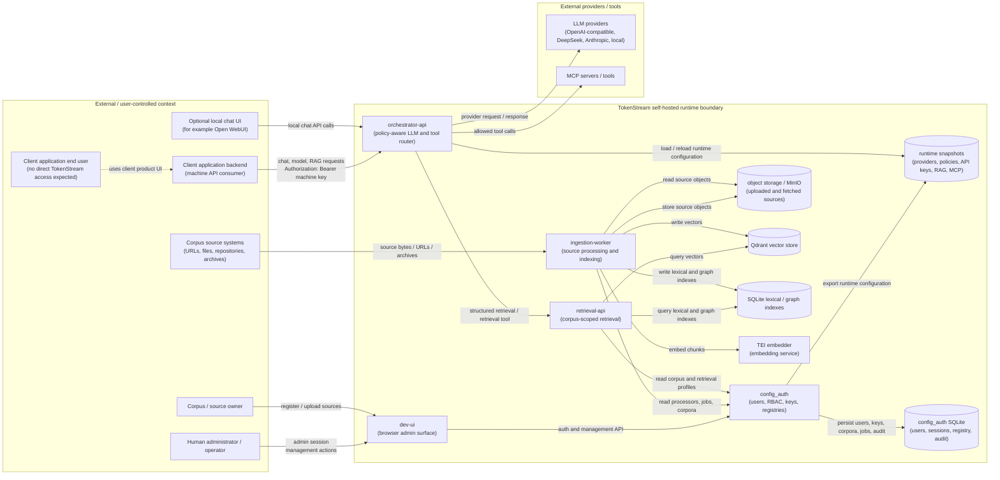

# Diagram 1: System Context / Runtime Architecture

This diagram is a high-level system context and runtime architecture view for the TokenStream CRA risk assessment. Its purpose is to identify what the system is, who interacts with it, which major runtime components exist inside the TokenStream boundary, and which external systems are relevant to cybersecurity risk.

## Interpretation

This diagram supports the product and environment description in the CRA risk assessment. It identifies:

- external actors and user-controlled systems;
- the TokenStream self-hosted runtime boundary;
- main TokenStream runtime services;
- security-relevant data stores and generated runtime configuration;
- external LLM providers and MCP/tool integrations;
- high-level runtime, administration, retrieval, and ingestion flows.

## Scope Notes

This diagram is intentionally not the detailed STRIDE threat model. It does not attempt to enumerate individual threats, protocol-level mitigations, vulnerability handling controls, or every attack surface entry. Those should be covered by the STRIDE Data Flow / Trust Boundary diagram and by the modelled attack-surface register.

The optional local chat UI is shown as an external or adjacent client surface because it is not the administrative control plane. In the CRA risk assessment, direct user access to `dev-ui` should still be treated as unintended outside trusted administration.
