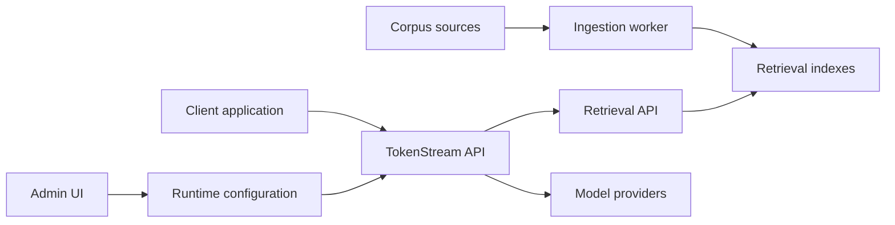

# What Is TokenStream

TokenStream is an open-source runtime for putting model access, provider routing, policy enforcement, tool use, and corpus-backed retrieval behind client-facing applications.

Use TokenStream when your application needs to answer with source-backed context, route requests across model providers, enforce model and tool policy per workflow, or manage corpora without making every client application own ingestion and retrieval infrastructure.

## What TokenStream provides

TokenStream gives your application a shared backend for:

- OpenAI-compatible chat and model endpoints
- provider and model routing
- pipeline policies for allowed providers, models, tools, corpora, filters, and retrieval limits
- machine API keys for service-to-service access
- corpus registration, source upload, ingestion jobs, and readiness checks
- hybrid retrieval over lexical, vector, and graph-aware indexes
- optional retrieval and MCP tool use inside model workflows
- an admin UI for runtime configuration

The stack is intentionally domain-neutral. TokenStream does not decide what your product should say, which documents matter, or how your application should present answers. Your application owns that product behavior; TokenStream owns the reusable runtime pieces.

## Where it sits

A typical deployment has a client application calling TokenStream instead of calling model providers, vector stores, and ingestion systems directly.

The public-facing product name is TokenStream. Some service names, environment variables, and file paths still use `orchestrator` as an internal implementation name.

## Main user workflows

The most common workflows are:

1. Configure model providers and policies.
2. Create a corpus for one application or workflow.
3. Register or upload sources for that corpus.
4. Start ingestion and wait for readiness.
5. Call TokenStream from a client application with an API key.
6. Retrieve source-backed context or use retrieval inside model calls.
7. Review citations and operational status when answers look wrong.

## What TokenStream is not

TokenStream is not a hosted documentation platform, a prompt authoring product, or a replacement for code review and source review. It can retrieve and route context, but your application still needs to decide what a good answer looks like and how users should evaluate citations.

<Note>
For public docs, describe TokenStream as the product. Use internal service names such as `orchestrator-api`, `retrieval-api`, `ingestion-worker`, and `dev-ui` only when explaining architecture or deployment.
</Note>
