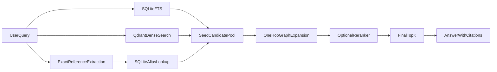

# Graph-Enhanced Retrieval

## Goal
This stack keeps the existing hybrid retrieval backbone and upgrades the old vanilla vector branch into a graph-enhanced retrieval path:

- SQLite FTS remains the lexical signal for exact text and identifier-style references.
- Qdrant remains the dense retrieval store.
- A lightweight corpus graph is stored inside each corpus SQLite file.
- Retrieval expands graph neighbors before final ranking.
- HTML chunking stays LLM-first for corpus ingestion.

## Retrieval Flow

## Ingestion Model
The ingestion worker now emits graph-friendly metadata on chunks and persists it into the corpus SQLite database:

- `canonical_nodes`: document and section-like nodes discovered during parsing
- `node_aliases`: exact-reference aliases discovered from source metadata and parsed structure
- `chunk_node_links`: mapping between stored chunks and canonical nodes
- `node_edges`: lightweight adjacency such as `part_of`, `has_section`, `prev`, `next`, and `refers_to`

The graph is intentionally lightweight:

- chunks still live in Qdrant and SQLite FTS
- legal structure and cross-references live in SQLite graph tables
- no dedicated graph database is introduced

## Parsing Strategy
The default parser is intentionally generic. Custom source-specific parsers can be added later as explicit extensions, but the base product should not assume a specific legal source, standard, or domain catalog.

## Ranking Order
1. Retrieve lexical candidates from SQLite FTS.
2. Retrieve dense candidates from Qdrant with `BAAI/bge-m3`.
3. Retrieve exact reference hits from graph aliases.
4. Expand one hop from seed nodes using stored graph edges.
5. Optionally rerank the bounded candidate pool when reranker dependencies are installed and `RERANKER_ENABLED=true`.
6. Return the final top-k chunks using the blended retrieval score when reranking is disabled.

## Operational Notes
- `tei-embedder` now uses `BAAI/bge-m3`.
- `retrieval-api` does not ship reranker dependencies in the base image. Build the `reranker` Docker target or install `services/retrieval_api/requirements-reranker.txt` in a custom image when local reranking is needed.
- `ingestion-worker` is wired to TokenStream so `strategy: llm` is active for HTML chunking in normal compose runs.
- LLM chunking is the supported production chunking path.
