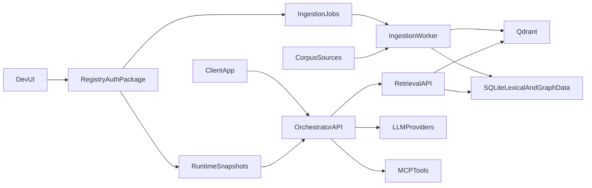
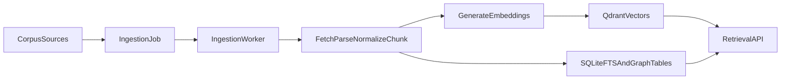
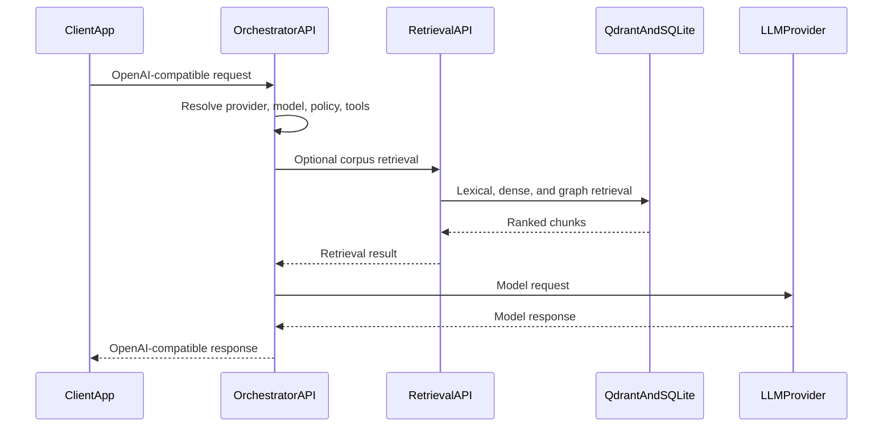

# Services Overview

## Purpose

This documentation describes the runtime boundaries in TokenStream: provider routing, policy enforcement, tool use, corpus ingestion, and retrieval. The core product is intentionally domain-neutral and is meant to sit behind client-facing applications.

## Service Index

- [`service_common.md`](service_common.md)
- [`service_ingestion_worker.md`](service_ingestion_worker.md)
- [`service_retrieval_api.md`](service_retrieval_api.md)
- [`service_orchestrator_api.md`](service_orchestrator_api.md)
- [`service_dev_ui.md`](service_dev_ui.md)
- [`package_config_auth.md`](package_config_auth.md)
- [`retrieval_graph_rag.md`](retrieval_graph_rag.md)

## OpenAPI Contracts

- [`openapi_management_api.yaml`](openapi_management_api.yaml)
- [`openapi_retrieval_api.yaml`](openapi_retrieval_api.yaml)
- [`openapi_orchestrator_api.yaml`](openapi_orchestrator_api.yaml)

For contract standards and review notes, see:

- [`openapi_pipeline_standard.md`](openapi_pipeline_standard.md)
- [`openapi_prioritized_endpoints.md`](openapi_prioritized_endpoints.md)
- [`openapi_code_drift_fixes.md`](openapi_code_drift_fixes.md)
- [`openapi_verification_steps.md`](openapi_verification_steps.md)

## What The Stack Does

At a high level:

- `dev-ui` provides the browser admin surface.
- The embedded `config_auth` package manages users, machine keys, providers, policies, corpora, sources, and ingestion jobs.
- `ingestion-worker` fetches source material, parses it, chunks it, embeds it, and writes retrieval indexes.
- `retrieval-api` answers corpus-scoped retrieval queries over lexical, vector, and graph-aware storage.
- `orchestrator-api` exposes OpenAI-compatible model routing, policy enforcement, retrieval tooling, and MCP tool orchestration.
- `common` provides shared contracts and helpers used by the runtime services.

## User-Facing And Internal Boundaries

The user-facing entry points are `dev-ui` and `orchestrator-api`. `retrieval-api` may be called directly by trusted internal clients, but in normal deployments it is called through TokenStream or retrieval tools. `ingestion-worker` is an internal background service. `common` and `config_auth` are packages, not deployed services.

## Runtime Context Outside `services`

- `docker-compose.yaml` defines the local service topology.
- `providers.json` and `policies.json` are bootstrap/runtime configuration inputs.
- `examples/corpora` contains optional demo corpus material.
- `data` stores runtime retrieval artifacts such as raw fetches, lexical SQLite files, and local index state.

## Ecosystem Topology

## Corpus Ingestion Lifecycle

`dev-ui` accepts corpus and source changes through the management API. The worker polls pending jobs from the registry, processes the selected sources, and writes retrieval artifacts. Ingestion is deliberately separate from retrieval so source processing can be slow, retryable, and observable without blocking query traffic.

## Query Lifecycle

## Reading Order

1. This overview
2. `service_orchestrator_api.md`
3. `service_retrieval_api.md`
4. `service_ingestion_worker.md`
5. `service_dev_ui.md`
6. `package_config_auth.md`
7. `service_common.md`
